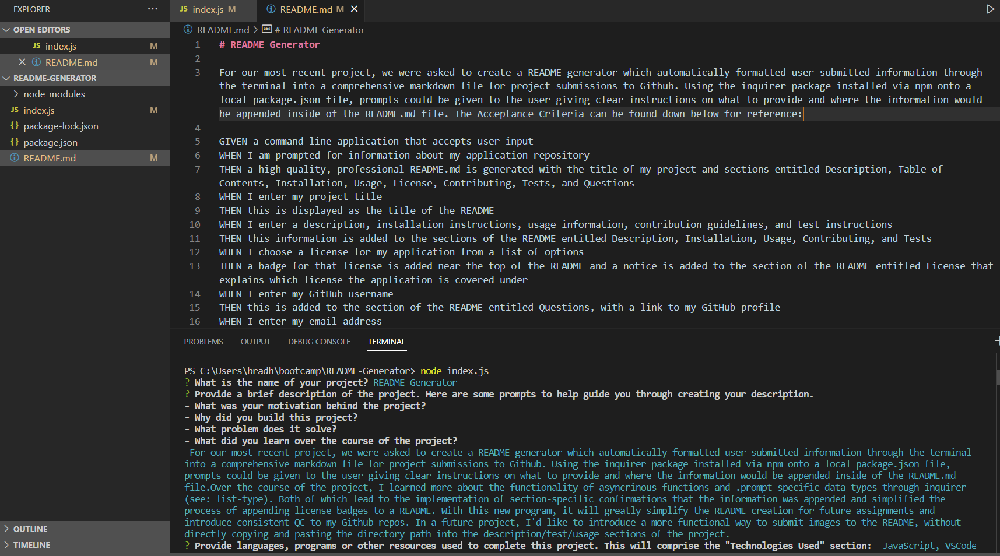
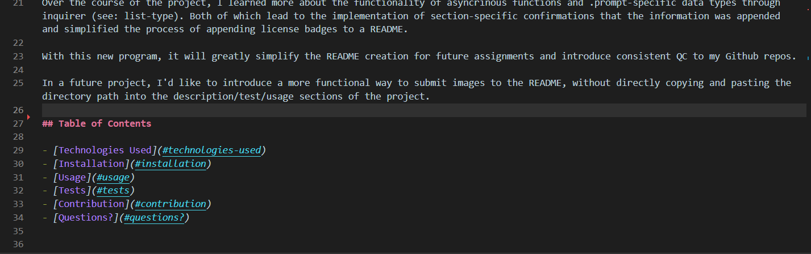
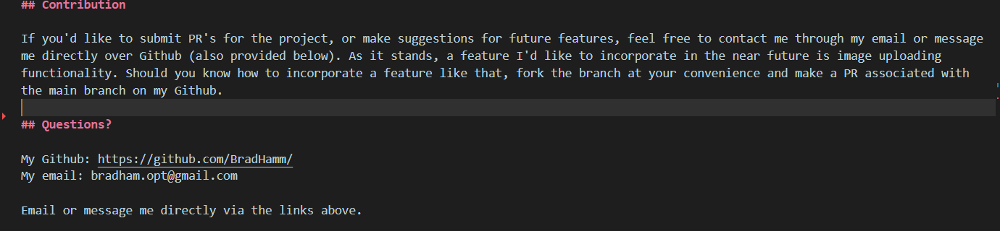

# README Generator

For our most recent project, we were asked to create a README generator which automatically formatted user submitted information through the terminal into a comprehensive markdown file for project submissions to Github. Using the inquirer package installed via npm onto a local package.json file, prompts could be given to the user giving clear instructions on what to provide and where the information would be appended inside of the README.md file. The Acceptance Criteria can be found down below for reference:

GIVEN a command-line application that accepts user input
WHEN I am prompted for information about my application repository
THEN a high-quality, professional README.md is generated with the title of my project and sections entitled Description, Table of Contents, Installation, Usage, License, Contributing, Tests, and Questions
WHEN I enter my project title
THEN this is displayed as the title of the README
WHEN I enter a description, installation instructions, usage information, contribution guidelines, and test instructions
THEN this information is added to the sections of the README entitled Description, Installation, Usage, Contributing, and Tests
WHEN I choose a license for my application from a list of options
THEN a badge for that license is added near the top of the README and a notice is added to the section of the README entitled License that explains which license the application is covered under
WHEN I enter my GitHub username
THEN this is added to the section of the README entitled Questions, with a link to my GitHub profile
WHEN I enter my email address
THEN this is added to the section of the README entitled Questions, with instructions on how to reach me with additional questions
WHEN I click on the links in the Table of Contents
THEN I am taken to the corresponding section of the README

Over the course of the project, I learned more about the functionality of asyncrinous functions and .prompt-specific data types through inquirer (see: list-type). Both of which lead to the implementation of section-specific confirmations that the information was appended and simplified the process of appending license badges to a README.

With this new program, it will greatly simplify the README creation for future assignments and introduce consistent QC to my Github repos.

In a future project, I'd like to introduce a more functional way to submit images to the README, without directly copying and pasting the directory path into the description/test/usage sections of the project.

## Table of Contents

- [Technologies Used](#technologies-used)
- [Installation](#installation)
- [Usage](#usage)
- [Tests](#tests)
- [Contribution](#contribution)
- [Questions?](#questions?)

## Technologies Used:

JavaScript
VSCode
Terminal 
Node.js v16
Inquirer NPM Package
NPM
Github.com
GitBash

## Installation

Before you can run the README generator, the package dependencies must be installed using npm i which will automatically install inquirer to a package.json file. (This is if you didn't already install the packages directly from Github). This requires you to have npm installed, which usually comes with Node.js installation. From there, you'll want to enter *node index.js* to run the program locally. FOllow each of the prompts, which will instruct you on what information to enter into the terminal. Once all user information has been passed through to the response object, it will be appended to a new README.md file within the README-Generator file. The console will log any errors that you may occur along the way. 

## Usage

The program will ask for the following information once the program begins running in the terminal. Make sure all submissions are in single paragraphs, as Node will interpret enter key submissions as you completing your submission for that particular section. The one exception to the text-based submissions is the license section. As mentioned in the terminal, you'll use your arrow keys to navigate up and down the list before confirming your selection with the Enter key. This will append the badge information as well as the name of the license into the README. All that's left to do is navigate to your newly created README within the Explorer section of VSCode, and save a copy of the README in a seperate location for your own purposes!

## Tests

One of the requirements for the project was to account for an 'empty string' submission for licenses - Otherwise interpreted as a 'No License' submission. This option was included in the list for licenses, and will completely disregard appending any kind of license information for that particular submission. Otherwise, it will append the badge and name normally. Here is a duplicate of the README created, but with the 'No License' option selected. The highlighted line represents where the license information would normally be appended in another circumstance:

## Contribution

If you'd like to submit PR's for the project, or make suggestions for future features, feel free to contact me through my email or message me directly over Github (also provided below). As it stands, a feature I'd like to incorporate in the near future is image uploading functionality. Should you know how to incorporate a feature like that, fork the branch at your convenience and make a PR associated with the main branch on my Github.

## License

License: MIT

## Questions?

My Github: https://github.com/BradHamm/
My email: bradham.opt@gmail.com

Email or message me directly via the links above. 